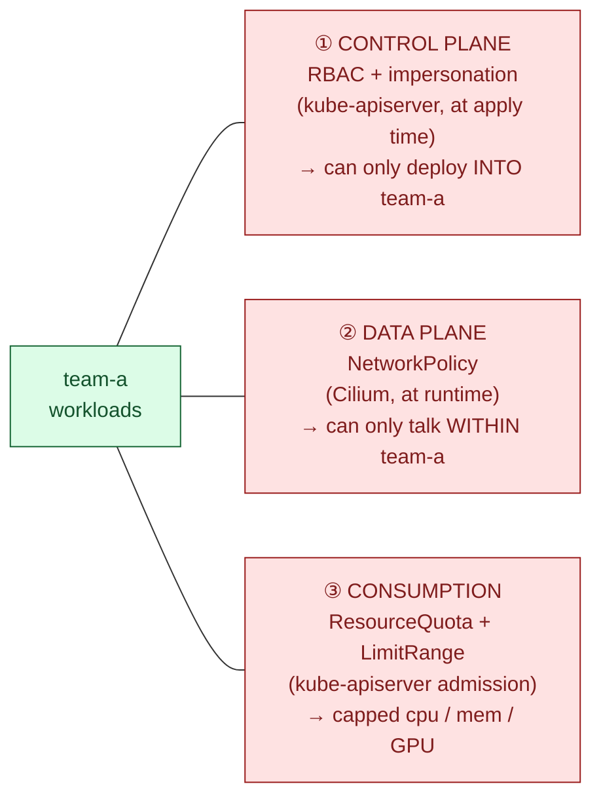
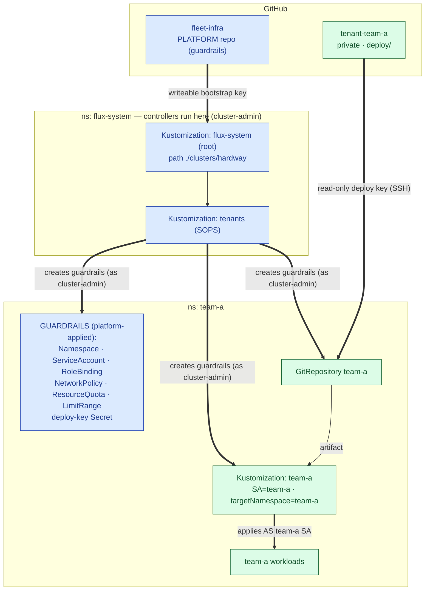
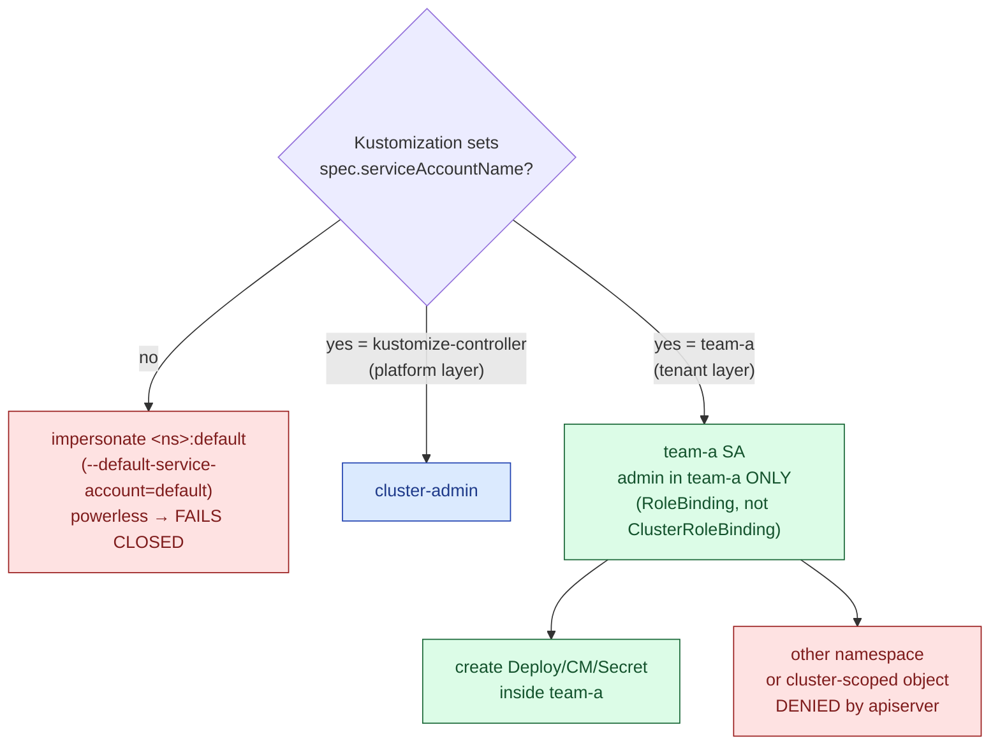
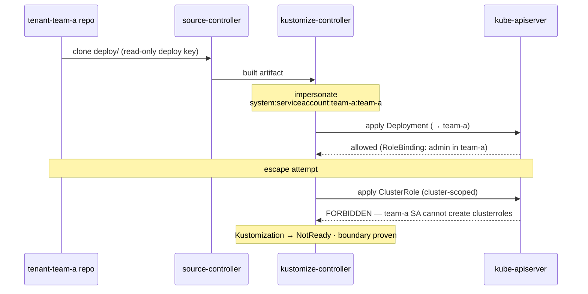
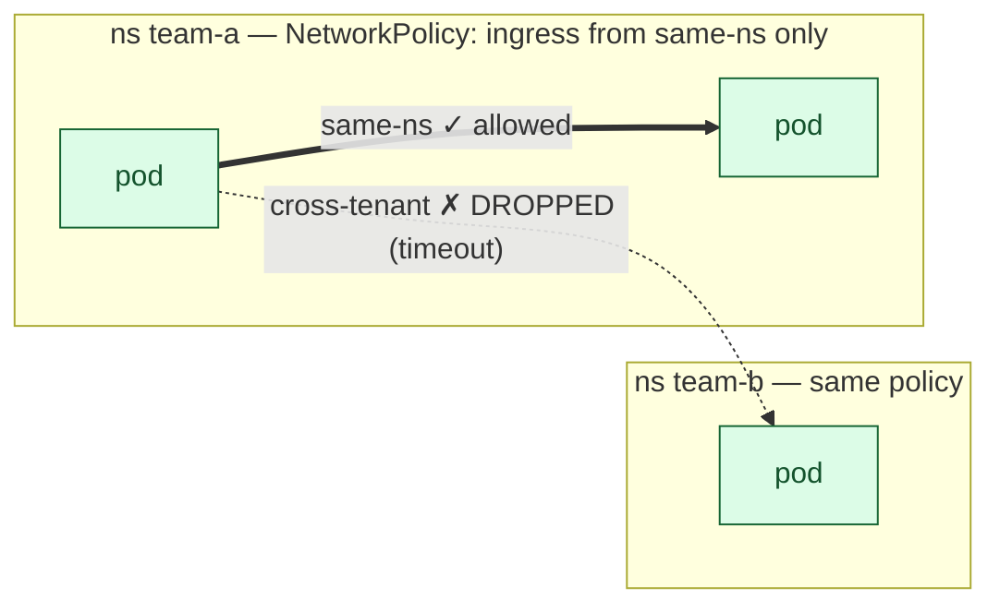
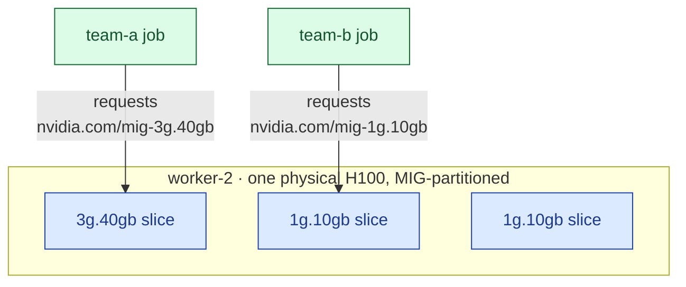

# Multi-tenancy architecture (hardway)

How the Flux multi-tenancy setup on the `hardway` cluster works. Two layers
(platform vs tenant) and **three independent isolation boundaries** around every
tenant, plus GPU partitioning.

Companion: `docs/CHEATSHEET.md` (concepts/commands), `HANDOFF.md` (live state).
Browser-renderable copy of the diagrams: `docs/tenancy-architecture.html`.

---

## 0. The big picture

**Two layers.** The *platform* repo (`fleet-infra`, this repo) is trusted and
cluster-admin; it draws the boundaries. Each *tenant* gets its own repo and only
fills in workloads *inside* the box the platform drew.

| Layer | Owner | Lives in | Trust |
|---|---|---|---|
| **Guardrails** | platform team | `fleet-infra` | cluster-admin |
| **Workloads** | each tenant | their own repo | confined |

**Three boundaries.** A tenant is boxed in on three independent axes. Each is a
*separate mechanism* enforced by a *different part* of the system — don't conflate
them:



| Boundary | Mechanism | Enforced by | When | "A tenant can't…" |
|---|---|---|---|---|
| **① Control plane** | RBAC + impersonation | kube-apiserver | apply time | …deploy outside its namespace |
| **② Data plane** | NetworkPolicy | the CNI (Cilium) | runtime | …talk to another tenant's pods |
| **③ Consumption** | ResourceQuota + LimitRange | kube-apiserver admission | create time | …starve neighbours / hog GPUs |

---

## 1. The two-layer GitOps control plane

How a commit becomes running workloads. Blue = platform (cluster-admin),
green = tenant (confined), red = secret.



The platform `tenants` Kustomization (cluster-admin) installs every guardrail
*plus* the tenant's own `GitRepository`+`Kustomization`. That tenant
Kustomization then reconciles the tenant's separate repo under a confined
identity. (team-b is an exact mirror.)

---

## 2. Boundary ① — Control plane (RBAC + impersonation)

RBAC alone isn't enough: Flux's `kustomize-controller` is itself cluster-admin.
The trick is **impersonation** — the controller applies a tenant's manifests
*as* the tenant's ServiceAccount, so the apiserver enforces the tenant's RBAC.



Request-level, and where the boundary bites:



Three sub-mechanisms make this airtight (set via the lockdown patches in
`clusters/hardway/flux-system/kustomization.yaml`):

| Sub-mechanism | Flag / object | Stops |
|---|---|---|
| **Identity** | `--default-service-account=default` + per-Kustomization `serviceAccountName` | Flux applying as cluster-admin on a tenant's behalf (fails closed if no SA named) |
| **RBAC scope** | **RoleBinding** (ns) vs ClusterRoleBinding (cluster) | the impersonated SA acting outside its namespace |
| **Reference scope** | `--no-cross-namespace-refs`, `--no-remote-bases` | a tenant pointing at another ns's source/Secret, or remote kustomize bases |

The asymmetry is the whole design: **platform Kustomizations name
`kustomize-controller` (cluster-admin); tenant Kustomizations name their own
ns-scoped SA.** helm-controller honours the same flag, so platform HelmReleases
name a privileged installer SA while a tenant's would be confined.

---

## 3. Boundary ② — Data plane (NetworkPolicy)

RBAC stops *deploys*; it never sees a packet. By default the pod network is flat
— every pod can reach every other pod across namespaces. A per-tenant
`NetworkPolicy` (standard `networking.k8s.io`, **enforced by Cilium**) closes
that: select all pods, allow ingress only from the *same namespace*.



Notes:
- A *drop* shows up as a **timeout**, not "connection refused" — the packet never
  arrives (the signature of a NetworkPolicy deny).
- We restrict **ingress** only; egress + DNS stay open (cleanest isolation
  without breaking name resolution).
- **Cilium enforces standard `NetworkPolicy`** — that's sufficient.
  `CiliumNetworkPolicy` is a *superset* CRD (adds L7 / `toFQDNs` / cluster-wide),
  reached for only when standard policy can't express the rule.

---

## 4. Boundary ③ — Consumption (ResourceQuota + LimitRange)

Stops a tenant from starving neighbours or hogging GPUs. Two objects, always
together:

- **ResourceQuota** caps a namespace's *totals* — cpu/mem (requests + limits),
  pod count, and GPU/MIG resources (extended resources are quota-able via the
  `requests.<resource>` key).
- **LimitRange** is the required companion: a quota on `requests.cpu` *rejects*
  any pod that omits a cpu request, so LimitRange supplies per-container
  **defaults** (and min/max bounds). Without it, tenants would get cryptic
  rejections on every bare pod.

Differentiated tenants (platform-owned — a tenant can't raise its own ceiling):

| | requests.cpu | requests.memory | GPU caps |
|---|---|---|---|
| **team-a** (larger) | 2 | 2Gi | `nvidia.com/gpu: 1`, `mig-3g.40gb: 1` |
| **team-b** (smaller) | 1 | 1Gi | `mig-1g.10gb: 2` |

Enforcement is at admission: a pod over the ceiling is rejected with
`Forbidden: exceeded quota …` *before* it schedules. A bare pod, conversely,
gets the LimitRange defaults injected automatically.

---

## 5. GPU isolation — MIG (spatial partitioning)

Multi-Instance GPU carves one physical GPU into hardware-isolated slices — the
GPU-level analog of the namespace boundary. (Distinct from *time-slicing*, which
shares one GPU temporally with no isolation.) On real silicon this needs
A100/H100; here the fake-gpu-operator simulates it.



How slices become schedulable (the Kubernetes-facing model, which is the
transferable part):
- A node opts into MIG via a nodePool label; its device-plugin advertises each
  slice profile as an **extended resource** (`nvidia.com/mig-3g.40gb`, …)
  registered *verbatim* from the topology's `otherDevices` list.
- Pods request a slice exactly like any resource: `nvidia.com/mig-1g.10gb: 1`.
- ResourceQuota caps them per tenant (see §4).
- Two tenants holding two slices of the *same* physical GPU = spatial
  multi-tenancy.

---

## 6. Where each piece lives in the repo

```
clusters/hardway/
├── flux-system/kustomization.yaml   # ① lockdown patches (3 flags + root SA pin)
├── infrastructure.yaml              # platform K — serviceAccountName: kustomize-controller
├── apps.yaml                        # platform K (SOPS) — same SA
└── tenants.yaml                     # platform K (SOPS) — same SA; applies tenants/hardway
tenants/hardway/
├── kustomization.yaml               # aggregates team-a + team-b
├── team-a/
│   ├── namespace.yaml               # ns team-a
│   ├── rbac.yaml                    # ① SA + RoleBinding→admin (ns-scoped)
│   ├── networkpolicy.yaml           # ② default-deny + same-ns allow
│   ├── quota.yaml                   # ③ ResourceQuota + LimitRange
│   ├── deploy-key.secret.yaml       # SOPS-encrypted read-only deploy key
│   └── sync.yaml                    # GitRepository + impersonated Kustomization
└── team-b/ (mirror)
infrastructure/controllers/hardway/
└── fake-gpu-operator-values.yaml    # the 'mig' nodePool (otherDevices = MIG slices)
```

Lockdown flags (JSON6902 patches on the gotk deployments):

| flag | kustomize-controller | helm-controller | notification-controller |
|---|:---:|:---:|:---:|
| `--no-cross-namespace-refs=true` | ✓ | ✓ | ✓ |
| `--no-remote-bases=true` | ✓ | — | — |
| `--default-service-account=default` | ✓ | ✓ | — |

Tenant workload repos (the green layer): `slikk66/tenant-team-a`,
`slikk66/tenant-team-b` (private; each a `deploy/` dir; read-only deploy keys).
