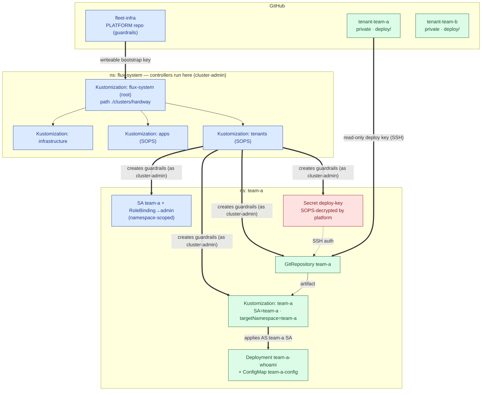
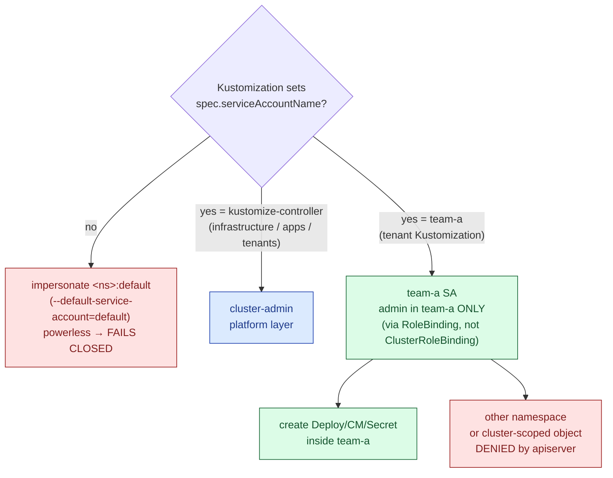
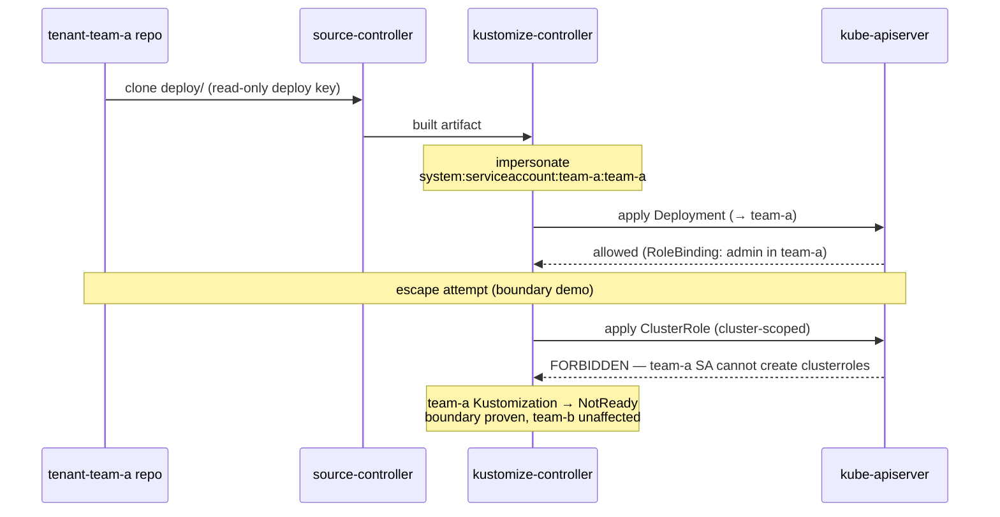

# Multi-tenancy architecture (hardway)

How the Flux multi-tenancy setup on the `hardway` cluster works: a **platform**
layer (this repo) that draws the boundaries, and **tenant** layers (separate
per-tenant repos) that fill them — each confined by Flux impersonation + RBAC.

Companion: `docs/CHEATSHEET.md` (concepts/commands), `HANDOFF.md` (state).

---

## 1. The two-layer GitOps control plane

How a commit becomes running workloads. Blue = platform (trusted, cluster-admin),
green = tenant (confined), red = secret.



*(team-b is an exact mirror — same shape, `team-b` everywhere.)*

The platform `tenants` Kustomization (running cluster-admin) creates the
*guardrails*: namespace, SA, RBAC, the decrypted deploy key, and the tenant's own
`GitRepository`+`Kustomization`. That tenant Kustomization then reconciles the
tenant's **separate repo** under a **confined identity**.

---

## 2. The impersonation decision — who applies as whom

The security heart. For *every* Kustomization, Flux picks an identity to impersonate:



The asymmetry is the whole design: **platform Kustomizations name
`kustomize-controller` (cluster-admin); tenant Kustomizations name their own
ns-scoped SA.** `--default-service-account=default` makes "forgot to name one"
fail safely instead of silently inheriting cluster-admin.

Helm path is identical: helm-controller also honours `--default-service-account`,
so platform HelmReleases name a privileged installer SA (`gpu-operator/helm-installer`,
cluster-admin) while a tenant HelmRelease would name a confined one.

---

## 3. Request-level flow + where the boundary bites



---

## 4. Three independent enforcement layers (don't conflate them)

| Layer | Mechanism | Stops |
|---|---|---|
| **Identity** | `--default-service-account` + per-Kustomization `serviceAccountName` | Flux applying as cluster-admin on a tenant's behalf |
| **RBAC scope** | RoleBinding (ns) vs ClusterRoleBinding (cluster) | the impersonated SA acting outside its namespace |
| **Reference scope** | `--no-cross-namespace-refs` / `--no-remote-bases` | a tenant pointing at another ns's secrets/sources, or remote bases |

---

## 5. Where each piece lives in the repo

```
clusters/hardway/
├── flux-system/kustomization.yaml   # lockdown patches (the 3 flags + root SA pin)
├── infrastructure.yaml              # platform K — serviceAccountName: kustomize-controller
├── apps.yaml                        # platform K (SOPS)  — same SA
└── tenants.yaml                     # platform K (SOPS)  — same SA; applies tenants/hardway
tenants/hardway/
├── kustomization.yaml               # aggregates team-a + team-b
├── team-a/
│   ├── namespace.yaml               # ns team-a
│   ├── rbac.yaml                    # SA team-a + RoleBinding→admin (ns-scoped)
│   ├── deploy-key.secret.yaml       # SOPS-encrypted read-only deploy key (ns team-a)
│   └── sync.yaml                    # GitRepository + Kustomization (impersonation)
└── team-b/ (mirror)
```

Controller lockdown flags (set via JSON6902 patches in
`clusters/hardway/flux-system/kustomization.yaml`):

| flag | kustomize-controller | helm-controller | notification-controller |
|---|:---:|:---:|:---:|
| `--no-cross-namespace-refs=true` | ✓ | ✓ | ✓ |
| `--no-remote-bases=true` | ✓ | — | — |
| `--default-service-account=default` | ✓ | ✓ | — |

Tenant workload repos (the green layer): `slikk66/tenant-team-a`,
`slikk66/tenant-team-b` (private; each a `deploy/` dir; read-only deploy keys).
